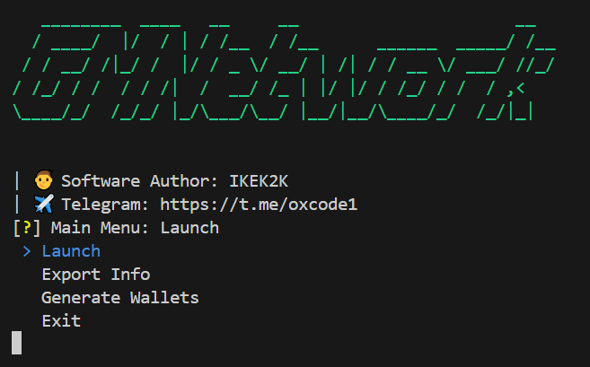

# SuperSight
[](https://t.me/oxcode1)

✈️[Telegram Channel](https://t.me/oxcode1)



## 💡Функционал  
| Функционал                                                     | Поддерживается  |
|----------------------------------------------------------------|:---------------:|
| Многопоточность                                                |        ✅       |
| Поддержка прокси любого формата                                |        ✅       |
| Регистрация аккаунта по реферальному коду                      |        ✅       |
| Daily CHECK-IN                                                 |        ✅       |
| Выполнение квестов - LAUNCHPAD GOALS                           |        ✅       |
| Генерация кошельков EVM                                        |        ✅       |

## [⚙️Настройки](https://github.com/NikeAK/SuperSight/blob/main/data/config.py)
| Настройка             | Описание                                                        |
|-----------------------|-----------------------------------------------------------------|
| **REFERRAL_CODE**     | Реферальный код                                                 |
| **USE_PROXY**         | Использовать прокси? - True/False                               |
| **LOGGER_PROXY**      | Вывод информацию о статусе прокси - True/False                  |
| **RATELIMIT_SLEEP**   | Время сна, после превышения лимита запросов - [min, max]        |

$\color{#58A6FF}\textsf{\Large\&#x24D8;\kern{0.2cm}\normalsize Note}$
**Перед началом работы, заполните $\color{yellow}{\textsf{private_keys.txt}}$ и $\color{yellow}{\textsf{proxy.txt}}$ 1к1!**

## ⚡️Быстрый запуск
1. Запустите $\color{orange}{\textsf{Setup.bat}}$. Этот скрипт автоматически создаст виртуальное окружение, активирует его, установит все необходимые зависимости из файла requirements.txt и удалит не нужные файлы.
2. После успешного выполнения $\color{orange}{\textsf{Setup.bat}}$, вы можете запустить $\color{orange}{\textsf{Main.bat}}$. Этот скрипт активирует виртуальное окружение и запустит софт.

## 🛠️Ручная установка
```shell
~ >>> python -m venv Venv              #Создание виртуального окружения
~ >>> Venv/Scripts/activate            #Активация виртуального окружения
~ >>> pip install -r requirements.txt  #Установка зависимостей
~ >>> python main.py                   #Запуск
```

## 💰DONATION EVM ADDRESS: 
**0x1C6E533DCb9C65BD176D36EA1671F7463Ce8C843**
